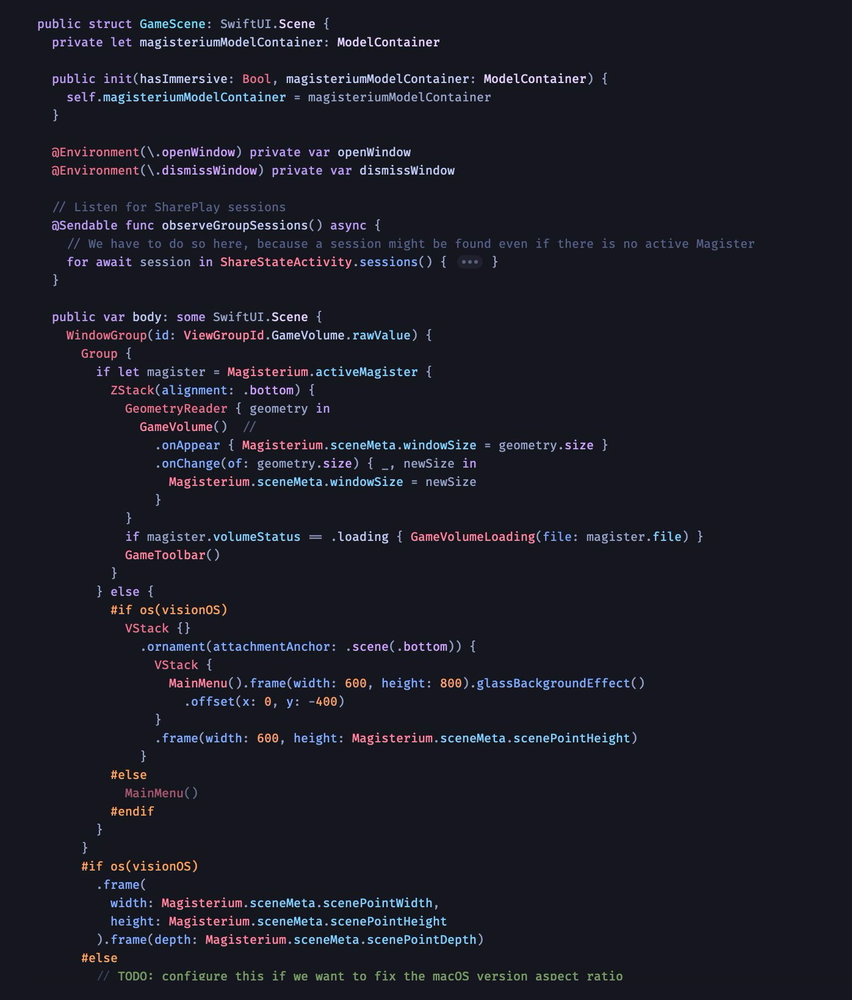
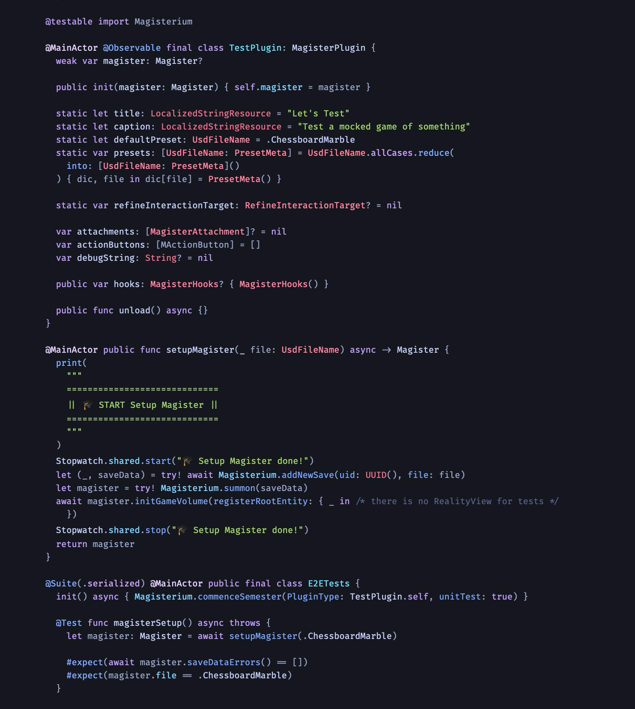

# 🌃 Tokyo Night Xcode Theme

An Xcode theme inspired by [Tokyo Night](https://github.com/tokyo-night/tokyo-night-vscode-theme).

> A clean Visual Studio Code theme that celebrates the lights of Downtown Tokyo at night.
>
> **Note:** Many UI elements are intentionally low contrast so as not to distract.

## Installation

```bash
# shut down Xcode
killall Xcode
# create the themes folder if it doesn't exist
mkdir -p ~/Library/Developer/Xcode/UserData/FontAndColorThemes
# download the theme straight into the themes folder
curl -o ~/Library/Developer/Xcode/UserData/FontAndColorThemes/TokyoNight.xccolortheme https://raw.githubusercontent.com/mesqueeb/TokyoNightXcodeTheme/refs/heads/main/TokyoNight.xccolortheme
# open Xcode
open -a Xcode
```

Then go to Settings > Themes and select the new TokyoNight theme. 🎉

## Examples

SwiftUI



Swift Testing


